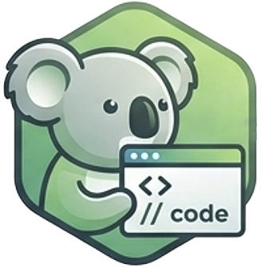

<div align="center">



# KoalaSnippets

**A blazing fast, zero-bloat, privacy-first snippet manager designed to cure Notepad++ tab hell.**

[](https://github.com/Shik3i/KoalaSnippets/releases)
[](https://hub.docker.com/r/shik3i/koalasnippets)
[](https://github.com/Shik3i/KoalaSnippets/actions)
[](https://nextjs.org/)
[](https://www.typescriptlang.org/)
[](https://www.sqlite.org/)
[](LICENSE)

<br />
<a href="https://snippets.koalastuff.net">
  
</a>
<br />

KoalaSnippets is a self-hosted web application for storing, organizing, and sharing code snippets. It features a clean two-pane interface, server-side syntax highlighting, and rock-solid security — all with **zero external dependencies**. No CDNs. No tracking. No bloat. Just your code, your server, your rules.

<!-- We recommend replacing this placeholder with a short feature showcase GIF -->


</div>

<details>
<summary><b>📚 Table of Contents</b></summary>

- [✨ Core Features](#-core-features)
- [🧱 Tech Stack](#-tech-stack)
- [🚀 Quick Start](#-quick-start)
- [🐳 Docker Deployment](#-docker-deployment)
- [📁 Project Structure](#-project-structure)
- [🔐 Security](#-security)
- [🗺️ Roadmap](#-roadmap)
- [📄 License](#-license)

<br/>
</details>

## ✨ Core Features

> [!TIP]
> KoalaSnippets is engineered to be the **ultimate cure for Notepad++ tab hell**. We stripped away the bloat and focused on a premium developer experience, rock-solid security, and blazing-fast performance.

### 🛡️ Privacy & Hardened Security
*Your code, your server, your rules. Zero external dependencies, zero tracking.*

| Feature | Description |
|---------|-------------|
| **Crypto-Grade Hashing** | Passwords secured via Argon2id + Salt + application-level Pepper. |
| **Timing Attack Resistance** | Shared tokens are compared using constant-time `crypto.timingSafeEqual`. |
| **Enterprise Defenses** | Strict CSP headers, Next.js Middleware rate-limiting, and 100% locally bundled assets (Next/Font, Lucide-React). |
| **Visibility Controls** | Public Explorer for anyone, secure shared links with unguessable tokens, or keep strictly private. |

### 🎨 Premium Aesthetic & UX
*A beautifully crafted two-pane interface that feels incredibly responsive and alive.*

| Feature | Description |
|---------|-------------|
| **Glassmorphic Command Palette** | Hit `Ctrl+K` / `⌘K` for a global frosted-glass HUD to search snippets instantly or execute slash commands (`/new`, `/settings`, `/backups`). |
| **Keyboard-Driven Workflow** | Full keyboard support: `Escape` to clear search or dismiss toasts, Arrow keys in filter dropdowns, `/` to focus search, Enter/Escape on confirmation modals. |
| **Dynamic Theming Engine** | Personalize your workspace with 7 custom app themes (incl. Dracula, Nordic, Midnight), 4 CSS-driven background patterns, and customizable list densities. |
| **Stats Dashboard** | A stunning public metrics page featuring glassmorphic cards tracking total snippets, lines of code, unique tags, and languages. |
| **Beautiful 2-Pane UI** | Responsive card grid, dark mode by default, clean shadcn/ui components, JetBrains Mono for code. |

### ⚡ Developer Workflow & Performance
*Built for power users who demand speed and precision.*

| Feature | Description |
|---------|-------------|
| **Multi-File Snippets & Collections** | Group related code pieces together seamlessly. Organize your workspace using tags, collections, and favorites. |
| **Premium Custom CodeEditor** | A zero-dependency native editor featuring automatic Tab indentation, matching bracket auto-closing, overtype skipping, and pair matching deletions. |
| **Lazy-Loaded Syntax Highlighting** | Server-side Shiki highlighting for 30+ languages, dynamically loaded on demand for instantaneous render times. |
| **Blazing Fast Search & Filters** | Server-side parameterized FTS-style queries with "include code in search" toggle. Collapsible filter panel with searchable combobox dropdowns for tags and languages, OR/AND logic toggle, and keyboard navigation. |

### 📥 Enterprise Reliability
*Set it and forget it. KoalaSnippets manages itself.*

| Feature | Description |
|---------|-------------|
| **Hardened WAL-Mode SQLite** | Configured for maximum concurrent read/write throughput with Write-Ahead Logging and tuned busy timeouts. |
| **Automated GFS Backups** | Built-in `VACUUM INTO` backup scheduler running silently in the background, enforcing Grandfather-Father-Son retention (7 daily, 4 weekly, 12 monthly). |
| **RBAC Admin Portal** | A dedicated control center for administrators to manage users, trigger backups manually, and monitor system health endpoints. |

## 🧱 Tech Stack

| Layer | Technology |
|-------|------------|
| Framework | Next.js 16 (App Router, React Server Components) |
| Language | TypeScript (strict mode) |
| Styling | Tailwind CSS v4 + shadcn/ui |
| Database | SQLite (better-sqlite3) |
| ORM | Drizzle ORM |
| Syntax Highlighting | Shiki (server-side with lazy-loading language modules) |
| Authentication | Session cookies + Argon2id + Pepper + RBAC |
| Fonts | next/font/google (Inter, JetBrains Mono) |
| Icons | lucide-react (bundled) |

## 🚀 Quick Start

### Prerequisites

- Node.js 20+
- npm (or pnpm/yarn)

### 1. Clone & Install

```bash
git clone https://github.com/Shik3i/KoalaSnippets.git
cd KoalaSnippets
npm install
```

### 2. Set Up Environment

```bash
cp .env.example .env
```

Edit `.env` with your values:

```env
# Required: Application-level pepper for password hashing
AUTH_PEPPER=your-long-random-string-here

# Required: Session encryption secret
SESSION_SECRET=another-long-random-string

# Optional: Admin user seeded on first boot
# CRITICAL: These default credentials ('admin' / 'admin') are for local testing only
# and MUST be changed to secure values before deploying to production!
ADMIN_USERNAME=admin
ADMIN_PASSWORD=admin

# Optional: Enable/disable user registration (default: false)
ALLOW_REGISTRATION=true

# Optional: SQLite database path
DATABASE_URL=file:./data/koalasnippets.db

# Optional: Backup directory (default: ./backups)
BACKUP_DIR=./backups

# Optional: Shared secret for programmatic API access (bypasses CSRF checks)
# API_KEY=your-api-key-here
```

> [!WARNING]
> The default seeded administrator credentials (`ADMIN_USERNAME=admin` / `ADMIN_PASSWORD=admin`) are strictly for local development and verification. You **MUST** change them to secure random values before pushing to staging or running in production!

Generate secure random strings:
```bash
node -e "console.log(require('crypto').randomBytes(32).toString('hex'))"
```

### 3. Initialize Database

```bash
mkdir -p data
npm run db:generate
npm run db:migrate
```

### 4. Start Development Server

```bash
npm run dev
```

Open [http://localhost:3000](http://localhost:3000). The server uses Turbopack for instant hot-reloading. The SQLite database initializes automatically on first access.

### Available Scripts

| Command | Description |
|---------|-------------|
| `npm run dev` | Start development server with Turbopack |
| `npm run build` | Build for production |
| `npm run start` | Start production server |
| `npm run lint` | Run ESLint |
| `npm run db:generate` | Generate Drizzle migrations |
| `npm run db:migrate` | Apply database migrations |
| `npm run db:studio` | Open Drizzle Studio (web-based DB browser) |

## 🐳 Docker Deployment

### Docker Compose (Recommended)

```bash
# Set environment variables
export AUTH_PEPPER="your-pepper"
export SESSION_SECRET="your-secret"
export ALLOW_REGISTRATION="true"
export ADMIN_USERNAME="admin"
export ADMIN_PASSWORD="your-secure-password"

# Build and run
docker compose up --build -d
```

Open [http://localhost:3000](http://localhost:3000). The SQLite database and backups persist across container restarts via Docker volumes.

### Manual Docker

```bash
docker build -t koalasnippets .
docker run -d -p 3000:3000 \
  -v koalasnippets-data:/app/data \
  -v koalasnippets-backups:/app/backups \
  -e AUTH_PEPPER=your-pepper \
  -e SESSION_SECRET=your-secret \
  -e ALLOW_REGISTRATION=true \
  -e ADMIN_USERNAME=admin \
  -e ADMIN_PASSWORD=your-secure-password \
  koalasnippets
```

### Reverse Proxy (Caddy)

See `Caddyfile.example` for a production-ready Caddy configuration with strict security headers (CSP, HSTS, X-Content-Type-Options).

## 📁 Project Structure

```
KoalaSnippets/
├── docs/                   # Architecture, security, and AI documentation
├── src/
│   ├── app/                # Next.js App Router (pages, API routes)
│   │   ├── api/            # API routes
│   │   │   ├── auth/       # Login, logout, register
│   │   │   ├── snippets/   # CRUD operations
│   │   │   ├── settings/   # Password change & appearance update
│   │   │   ├── admin/      # Admin-only: users, backups, stats
│   │   │   ├── health/     # Health check endpoint
│   │   │   └── public/     # Public API (stats)
│   │   ├── admin/          # Admin dashboard (RBAC protected)
│   │   ├── dashboard/      # User snippet management
│   │   ├── snippets/[id]/  # Snippet detail view
│   │   ├── settings/       # User settings & Appearance settings
│   │   ├── stats/          # Public statistics page
│   │   ├── impressum/      # German imprint
│   │   └── privacy/        # Privacy policy
│   ├── features/           # Domain-driven features folders (Restructured)
│   │   ├── admin/          # Backup UI lists, metrics, scheduling logic & admin guards
│   │   ├── auth/           # Login/register forms, session handlers & crypt auth utils
│   │   ├── snippets/       # Snippet cards, search header with filter dropdowns, custom CodeEditor, sort/view toggles, bulk actions & lazy Shiki highlighting
│   │   │   └── utils/       #   Keyboard shortcuts, filter logic (OR/AND), shared constants (VISIBILITY_CONFIG)
│   │   └── core/           # Common layouts (sidebar with inline collection form, detail-view), confirm modals, global rate limiters, CommandPalette & styles
│   ├── components/
│   │   └── ui/             # shadcn/ui base primitives (buttons, inputs, cards, toasts with exit animations, confirm-modal)
│   ├── db/                 # Drizzle schema, migrations, connection (WAL enabled)
│   ├── proxy.ts            # Next.js Middleware (renamed from middleware.ts for compatibility)
│   ├── instrumentation.ts  # Server lifecycle hooks (backup, seeding)
│   ├── Dockerfile          # Multi-stage production build
│   ├── docker-compose.yml      # Docker orchestration
│   ├── Caddyfile.example       # Reverse proxy with security headers
│   └── PRIVACY.md              # Detailed privacy policy
```

## 🔐 Security

- Passwords hashed with **Argon2id + Salt + Pepper**
- Session tokens stored as hashes, never plaintext
- Strict CSP and security headers via Next.js config + Caddy
- Zero external CDNs — everything bundled locally
- SQL injection prevented via Drizzle parameterized queries
- Timing-attack-resistant token comparison (`crypto.timingSafeEqual`)
- Rate limiting on login (5/15min) and registration (3/60min)
- Role-based access control (RBAC) — admin routes return 403 for non-admins

See [docs/SECURITY.md](docs/SECURITY.md) for the full security specification.

## 🗺️ Roadmap

We are constantly improving KoalaSnippets. Check out our [Roadmap](docs/ROADMAP.md) to see what planned features (like CLI integration and API Keys) are coming next!

## 📄 License

MIT
