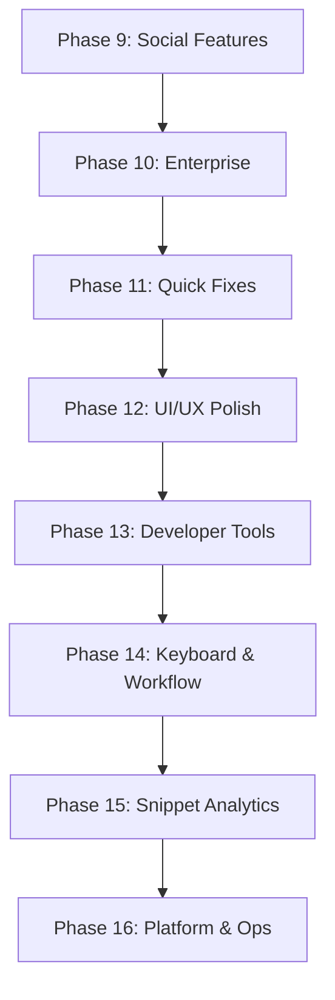

# 🗺️ KoalaSnippets Roadmap

Diese Datei dient als zentrale Planungsdokumentation für neue Features.
Abgeschlossene Features werden nach Deployment aus dieser Datei entfernt.

## Format für neue Feature Requests

Jedes neue Feature soll nach folgendem Schema dokumentiert werden:

```markdown
### 🏷️ Phase X: <Thema>
*<Ein-Satz-Beschreibung der Phase>*

#### 1. <Feature-Name>
- **Description**: <Was soll das Feature tun? Welches Problem löst es?>
- **Implementation**:
  - <Konkreter Schritt 1 mit Dateipfad>
  - <Konkreter Schritt 2 mit Dateipfad>
  - <Konkreter Schritt 3 mit Dateipfad>
- **Estimated Effort**: ~XXX lines of code.

#### 2. <Feature-Name>
...
```

**Regeln:**
- Jede Phase hat ein klares Thema (z.B. "Performance", "Sharing", "Developer Tools")
- Jedes Feature beschreibt WAS es tut, WIE es implementiert wird und WIEVIEL Aufwand es kostet
- Dateipfade müssen konkret sein (`src/features/...`, `src/app/...`)
- Der Mermaid-Graph am Anfang zeigt die Abhängigkeiten zwischen Phasen
- Geschätzte LOC beziehen sich auf die reine Code-Änderung (ohne Tests/Kommentare)

---

## 🔮 Nächste Phasen



**Priorisierungs-Logik:** Quick Fixes zuerst (schnell, stabilisierend, < 2h total) → UI/UX Polish (spürbare Verbesserung) → Developer Tools (client-side, kein Backend-Risiko) → Keyboard & Workflow (baut auf Bestehendem auf) → Snippet Analytics (API-Änderungen) → Platform & Ops (Betrieb, nicht Endnutzer-kritisch).

### 🤝 Phase 9: Social & Collaboration
*Erweitert die Community-Interaktion mit Kommentaren, Reaktionen und Benachrichtigungen.*

#### 1. Snippet Comments & Discussions
- **Description**: Erlaube Nutzern, öffentliche Snippets zu kommentieren. Thread-basierte Diskussionen mit Markdown-Support.
- **Implementation**:
  - `snippet_comments` Tabelle in `src/db/schema.ts` (id, snippet_id, user_id, content, parent_id, created_at)
  - Kommentar-UI unterhalb des Code-Blocks in `src/features/core/components/detail-view.tsx`
  - API-Route `src/app/api/snippets/[id]/comments/route.ts`
- **Estimated Effort**: ~400 lines of code.

#### 2. Snippet Reactions (Emoji)
- **Description**: Quick emoji reactions (👍, ❤️, 🚀) auf Snippets ohne kompletten Kommentar.
- **Implementation**:
  - `snippet_reactions` Tabelle (snippet_id, user_id, emoji)
  - Reaktion-Leiste in DetailView und SnippetCard
  - Optimistisches UI-Update mit Debounce
- **Estimated Effort**: ~200 lines of code.

#### 3. Webhook Notifications
- **Description**: Sende Webhooks bei Events (neuer Fork, neuer Kommentar). Nutzer konfigurieren URLs in den Settings.
- **Implementation**:
  - `webhooks` Tabelle und Settings-UI in `src/app/settings/`
  - Outbound HTTP POST mit Signatur (HMAC) in `src/features/core/utils/webhook.ts`
  - Rate-Limiting und Retry-Logik
- **Estimated Effort**: ~300 lines of code.

---

### 🏢 Phase 10: Enterprise & Ops
*Features für Teams und Betrieb.*

#### 1. OAuth / OIDC Authentication
- **Description**: Login via GitHub, Google, oder generischem OIDC-Provider zusätzlich zur lokalen Registrierung.
- **Implementation**:
  - NextAuth.js oder custom OIDC-Client in `src/features/auth/`
  - `oauth_accounts` Tabelle für verknüpfte Accounts
  - Konfiguration via Environment-Variablen (`OAUTH_GITHUB_CLIENT_ID`, etc.)
- **Estimated Effort**: ~500 lines of code.

#### 2. Snippet Collections (Ordner-Struktur)
- **Description**: Hierarchische Ordner für Snippets mit Drag & Drop.
- **Implementation**:
  - `collections` Tabelle um `parent_id` und `sort_order` erweitern
  - Tree-View in der Sidebar
  - Drag & Drop API in `src/features/snippets/components/`
- **Estimated Effort**: ~350 lines of code.

#### 3. Audit Log Dashboard
- **Description**: UI für Admin-Audit-Logs mit Filterung und Export.
- **Implementation**:
  - Admin-Seite `src/app/admin/audit/page.tsx`
  - Filterbare Tabelle mit Pagination
  - CSV-Export
- **Estimated Effort**: ~200 lines of code.

---

### 🐛 Phase 11: Quick Fixes & Polishes *(Prio 1 — Sofort umsetzen)*
*Kleine Verbesserungen die schnell umsetzbar sind (< 2h total) und sofort spürbaren Mehrwert liefern. Bugs, Accessibility, Stabilität.*

#### 1. Fehlende aria-labels für Icon-Only Buttons
- **Description**: Mehrere Icon-Only Buttons (z.B. in Snippet-Cards, Filter-Dropdowns) haben keine `aria-label` Attribute.
- **Implementation**:
  - `src/features/snippets/components/snippet-card.tsx` — Alle Icon-Buttons mit `aria-label` versehen
  - `src/features/snippets/components/search-header.tsx` — Filter-Toggle-Buttons labeln
- **Estimated Effort**: ~40 lines of code.

#### 2. Loading State für Collection-Erstellung in Sidebar
- **Description**: Collection-Erstellung in Sidebar zeigt keinen Loading-State. Button sollte disabled werden während POST läuft.
- **Implementation**:
  - `src/features/core/components/sidebar.tsx` — Visuelles Feedback (Spinner/Text) während `await fetch("/api/collections", ...)`
- **Estimated Effort**: ~20 lines of code.

#### 3. Ungenutzte Imports bereinigen
- **Description**: Mehrere Dateien importieren unused Variablen/Types.
- **Implementation**:
  - `npm run lint` ausführen und alle `no-unused-vars` Warnungen beheben
- **Estimated Effort**: ~30 lines of code (über mehrere Dateien).

#### 4. Error Boundary für /tools Route
- **Description**: Die `/tools` Route-Gruppe hat keine Error Boundary. Ein JS-Fehler in einem Tool würde die gesamte App crashen.
- **Implementation**:
  - `src/app/(tools)/error.tsx` — Neue Error Boundary Komponente (analog zu `src/app/dashboard/error.tsx`)
- **Estimated Effort**: ~30 lines of code.

#### 5. "Zuletzt verwendet" Snippets in Sidebar cachen
- **Description**: `use-recent-snippets` Hook (bereits vorhanden) ausbauen: Max-Einträge auf 10 begrenzen und "Clear" Button hinzufügen.
- **Implementation**:
  - `src/features/core/hooks/use-recent-snippets.ts` — Max-Einträge begrenzen
  - `src/features/core/components/sidebar.tsx` — Clear-Button neben "Recently Accessed" Überschrift
- **Estimated Effort**: ~40 lines of code.

---

### 🎨 Phase 12: UI/UX Polish & Accessibility *(Prio 2 — Spürbare UX-Verbesserung)*
*Feinschliff der Benutzeroberfläche mit besserer Navigation und Toast-Verhalten.*

#### 1. Breadcrumb-Navigation
- **Description**: Breadcrumb-Leiste oberhalb des Hauptinhalts zeigt Pfad (z.B. "Dashboard > Collection: APIs > Snippet: Auth Helper").
- **Implementation**:
  - `src/features/core/components/breadcrumb.tsx` — Neue Komponente, liest Route + Query-Params
  - Einbau in Dashboard-Layout und Detail-View
- **Estimated Effort**: ~120 lines of code.

#### 2. Toast-Stacking Hover-Pause
- **Description**: Auto-Dismiss Timer der Toasts pausieren bei Hover, damit lange Nachrichten gelesen werden können. (Toast-System mit Stacking existiert bereits.)
- **Implementation**:
  - `src/components/ui/toast.tsx` — Hover-Pause via `onMouseEnter`/`onMouseLeave` für jeden Toast-Timer
- **Estimated Effort**: ~50 lines of code.

---

### 🧰 Phase 13: Developer Tools Expansion *(Prio 3 — Client-side, kein Backend-Risiko)*
*Erweitert den /tools Hub um nützliche Alltags-Utilities. Alle Tools laufen 100% im Browser, kein Server-Code nötig.*

#### 1. Regex Tester
- **Description**: Interaktiver Regex-Tester mit Live-Match-Highlighting, Flags (g, i, m), und Test-String-Eingabe. Hilft beim schnellen Validieren von Patterns ohne externe Sites.
- **Implementation**:
  - Neuer Eintrag im `tools` Array in `src/app/(tools)/tools/page.tsx`
  - Inline-Komponente: Pattern-Input, Flags-Checkboxes, Test-String textarea, Match-Highlighting via `String.matchAll()`
  - Neue Route `src/app/(tools)/tools/regex/page.tsx`
- **Estimated Effort**: ~180 lines of code.

#### 2. Timestamp Converter
- **Description**: Konvertiert Unix-Timestamps (seconds/milliseconds) ↔ ISO 8601 ↔ relative Zeit ("vor 3 Stunden"). Bidirektional mit Live-Vorschau.
- **Implementation**:
  - Neuer Eintrag im `tools` Array in `src/app/(tools)/tools/page.tsx`
  - Inline-Komponente: Input-Feld (auto-detect sec/ms), Ausgabe-Boxen für ISO, human-readable, relative time via `Intl.RelativeTimeFormat`
- **Estimated Effort**: ~120 lines of code.

#### 3. URL Encoder/Decoder
- **Description**: Encode/decode URLs, Query-Params, und Components (encodeURIComponent vs encodeURI). Mit separaten Feldern für full URL vs component.
- **Implementation**:
  - Neuer Eintrag im `tools` Array in `src/app/(tools)/tools/page.tsx`
  - Zwei Modi (Encode/Decode) analog zu Base64-Tool, nutzt native `encodeURIComponent()` / `decodeURIComponent()`
- **Estimated Effort**: ~90 lines of code.

#### 4. Color Converter (HEX ↔ RGB ↔ HSL)
- **Description**: Farbumrechnung zwischen HEX, RGB, und HSL mit Live-Color-Preview-Swatch und Copy-to-Clipboard für alle Formate.
- **Implementation**:
  - Neuer Eintrag im `tools` Array in `src/app/(tools)/tools/page.tsx`
  - Inline-Komponente: 3 Input-Felder (HEX, RGB, HSL), großer Color-Swatch-Preview, Konvertierungslogik in `src/features/core/utils/color.ts`
- **Estimated Effort**: ~150 lines of code.

---

### ⌨️ Phase 14: Keyboard & Workflow Enhancements *(Prio 4 — Baut auf Bestehendem auf)*
*Verbessert die Tastatur-Navigation und den Arbeitsfluss für Power-User. Baut auf existierendem Command Palette und Shortcut-System auf.*

#### 1. Command Palette Erweiterungen
- **Description**: Command Palette (`Ctrl+K`) um Quick-Actions erweitern: `/tools` (Tool-Auswahl), `/theme <name>` (Theme-Wechsel), `/density <compact|preview|full>`, `/import`.
- **Implementation**:
  - `src/features/core/components/command-palette.tsx` — Slash-Command-Parser erweitern
  - Theme-Wechsel via `document.documentElement.classList` Manipulation
  - Tool-Auswahl zeigt Tool-Liste mit Navigation zu `/tools/<tool>`
- **Estimated Effort**: ~200 lines of code.

#### 2. Globale Tastatur-Shortcuts erweitern
- **Description**: Zusätzliche Shortcuts: `Ctrl+N` (neues Snippet), `Ctrl+Shift+T` (Trash öffnen), `Ctrl+Shift+D` (Dashboard). Shortcut-Hilfe-Overlay (`?` Taste) das alle Shortcuts anzeigt.
- **Implementation**:
  - `src/features/snippets/utils/keyboard-shortcuts.ts` — Shortcut-Registry erweitern
  - Shortcut-Hilfe-Overlay als neue Komponente `src/features/core/components/shortcut-help.tsx`
- **Estimated Effort**: ~180 lines of code.

---

### 📊 Phase 15: Snippet Analytics & Insights *(Prio 5 — API-Änderungen nötig)*
*Gibt Nutzern Einblicke in ihre Snippet-Sammlung. Benötigt teilweise API-Erweiterungen.*

#### 1. Snippet-Statistiken (Zeilen, Wörter, Komplexität)
- **Description**: Detail-Ansicht zeigt Statistiken pro Snippet: Zeichenanzahl, Wörter, Zeilen, geschätzte Lesezeit, Sprache-Verteilung bei Multi-File-Snippets. (`total_lines` existiert bereits im Schema, aber keine detaillierte UI-Anzeige.)
- **Implementation**:
  - `src/features/snippets/utils/snippet-stats.ts` — Berechnungslogik (Zeichen, Wörter, Zeilen)
  - Statistik-Badge/Panel in `src/features/core/components/detail-view.tsx` unterhalb des Code-Blocks
- **Estimated Effort**: ~150 lines of code.

#### 2. Duplicate Detection UI
- **Description**: Beim Erstellen wird geprüft ob ein Snippet mit gleichem Content-Hash bereits existiert. Warnung mit Link zum existierenden Snippet. (`contentHash` Spalte und Backend-Check existieren bereits, aber keine UI-Warnung.)
- **Implementation**:
  - `src/app/api/snippets/route.ts` (POST) — Bestehenden contentHash-Vergleich nutzen, Response um `duplicateId` erweitern
  - UI-Warnung in `src/app/dashboard/new/page.tsx`: "Ein Snippet mit identischem Inhalt existiert bereits: [Link]"
- **Estimated Effort**: ~100 lines of code.

#### 3. Export als Markdown
- **Description**: Snippet exportieren als Markdown-Datei mit Frontmatter (title, description, tags, language) und fenced code block.
- **Implementation**:
  - `src/features/snippets/utils/export.ts` — Markdown-Generator
  - Download-Button erweitert in `src/features/core/components/detail-view.tsx` (Dropdown: "Download as .md")
- **Estimated Effort**: ~120 lines of code.

---

### 🔧 Phase 16: Platform & Operations *(Prio 6 — Betrieb, nicht Endnutzer-kritisch)*
*Verbessert Betrieb, Monitoring und Wartbarkeit. Wichtig für Admins, aber nicht dringend für Endnutzer.*

#### 1. Health-Dashboard (erweitert)
- **Description**: Erweiterte Health-Info im Admin-Bereich: DB-Größe, letzte Backup-Zeit, Uptime, letzte DB-Optimierung.
- **Implementation**:
  - `src/app/api/admin/stats/route.ts` — Erweitern um DB-Größe (`PRAGMA page_count * page_size`), Uptime (`process.hrtime`), letzte Backup-Zeit
  - `src/features/admin/components/admin-metrics.tsx` — Neue Karten für Health-Metriken
- **Estimated Effort**: ~200 lines of code.

#### 2. Automatische DB-Optimierung
- **Description**: Geplante VACUUM und ANALYZE Operationen (wöchentlich) für optimale DB-Performance. Status im Admin-Dashboard.
- **Implementation**:
  - `src/features/admin/utils/db-maintenance.ts` — Neue Utility: `VACUUM`, `ANALYZE`, `PRAGMA integrity_check`
  - Scheduler analog zu `backup-scheduler.ts` in `src/instrumentation.ts` registrieren
- **Estimated Effort**: ~150 lines of code.

#### 3. CLI-Tool Erweiterungen
- **Description**: CLI (`cli/koala.sh` / `cli/koala.ps1`) um neue Befehle erweitern: `koala search <query>`, `koala new <file>`, `koala list --tags`, `koala export`.
- **Implementation**:
  - `cli/koala.sh` und `cli/koala.ps1` — Neue Subcommands hinzufügen
  - Nutzen existierende API-Endpoints mit API-Key-Auth
- **Estimated Effort**: ~200 lines of code.
