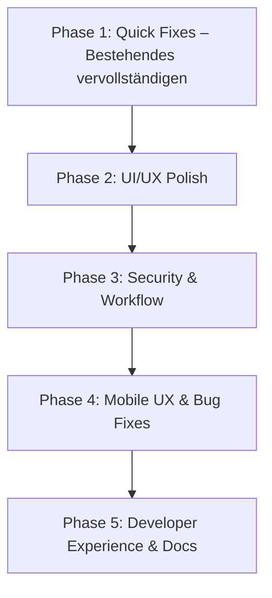

# 🗺️ KoalaSnippets Roadmap

Diese Datei dient als zentrale Planungsdokumentation für neue Features.
Abgeschlossene Features werden nach Deployment aus dieser Datei entfernt.

## Format für neue Feature Requests

Jedes neue Feature soll nach folgendem Schema dokumentiert werden:

```markdown
### 🏷️ Phase X: <Thema>
*<Ein-Satz-Beschreibung der Phase>*

#### 1. <Feature-Name>
- **Description**: <Was soll das Feature tun? Welches Problem löst es?>
- **Implementation**:
  - <Konkreter Schritt 1 mit Dateipfad>
  - <Konkreter Schritt 2 mit Dateipfad>
  - <Konkreter Schritt 3 mit Dateipfad>
- **Estimated Effort**: ~XXX lines of code.
```

**Regeln:**
- Jede Phase hat ein klares Thema (z.B. "Quick Fixes", "UI/UX", "Security")
- Jedes Feature beschreibt WAS es tut, WIE es implementiert wird und WIEVIEL Aufwand es kostet
- Dateipfade müssen konkret sein (`src/features/...`, `src/app/...`)
- Geschätzte LOC beziehen sich auf die reine Code-Änderung (ohne Tests/Kommentare)

---

## 🔮 Nächste Phasen



**Priorisierungs-Logik:** Teilweise vorhandene Features vervollständigen (minimaler Rest-Aufwand, sofortiger Gewinn) → UI/UX Polish (spürbare Verbesserung der wahrgenommenen Qualität) → Security & Workflow (Vertrauen und Power-User-Experience) → Mobile UX & Bug Fixes (Mobile-First-Qualität, behebt echte Nutzungsprobleme) → Developer Experience (Wartbarkeit, Docs).

---

### 🔧 Phase 1: Quick Fixes – Bestehendes vervollständigen
*Diese Features sind bereits zu 80–90% implementiert. Es fehlen nur noch gezielte Nachbesserungen mit minimalem Aufwand.*

#### 1. Fehlende DB-Indizes ergänzen
- **Status**: Die meisten von Claude vorgeschlagenen Indizes existieren bereits:
  - ✅ `snippet_files(snippet_id)` — `file_snippet_idx`
  - ✅ `collections(user_id)` — `collection_user_idx`
  - ✅ `snippets(created_at)` — `snippet_created_at_idx`
  - ✅ `snippets(author_id, created_at)` — Composite-Index vorhanden
  - ❌ `snippets(updated_at)` — **Fehlt**. Wird für Sortierung nach "newest/oldest" und die "Zuletzt bearbeitet"-Sektion benötigt.
  - ❌ `user_favorites(user_id, snippet_id)` Unique-Constraint — **Fehlt**. Ohne diesen kann ein User dasselbe Snippet mehrfach favorisieren.
- **Description**: Die zwei fehlenden Indizes per Drizzle-Migration ergänzen.
- **Implementation**:
  - `src/db/schema.ts`: Index auf `snippets.updated_at` definieren + Composite Unique Constraint auf `user_favorites(user_id, snippet_id)`.
  - `npm run db:generate` für neue Migration ausführen.
  - `npm run db:migrate` zum Anwenden.
- **Estimated Effort**: ~15 lines of code (Schema-Änderungen) + 1 Migration.

#### 2. Standardisierte API-Fehlerantworten (zentrale Utility)
- **Status**: Alle API-Routes geben bereits konsistent `{ error: "..." }` zurück — aber jede Route schreibt das Format manuell. Es fehlt eine zentrale Utility-Funktion.
- **Description**: Eine `createErrorResponse(status, code, message)` Utility-Funktion erstellen, die das einheitliche Format `{ error: { code: "VALIDATION_ERROR", message: "Title is required" } }` produziert. Bestehende Routes schrittweise umstellen.
- **Implementation**:
  - `src/features/core/utils/api-error.ts` — Neue Utility: `createErrorResponse(statusCode, errorCode, message)` die `NextResponse.json({ error: { code, message } }, { status })` wrappt.
  - Vordefinierte Error-Codes als Konstanten (`VALIDATION_ERROR`, `UNAUTHORIZED`, `FORBIDDEN`, `NOT_FOUND`, `RATE_LIMITED`, `INTERNAL_ERROR`).
  - Optionale `details`-Property für zusätzliche Kontextinformationen (z.B. Zod-Validierungsfehler).
  - Schrittweise Umstellung der API-Routes (niedrige Priorität, betrifft kein User-facing Verhalten).
- **Estimated Effort**: ~40 lines of code (Utility) + sukzessive Umstellung bestehender Routes.

#### 3. Command Palette: Suchverlauf + Fuzzy-Matching
- **Status**: Die Command Palette (`Ctrl+K`) existiert mit Slash-Commands und Snippet-Suche. Es fehlen:
  - ❌ **Suchverlauf**: Letzte 5 Suchanfragen werden nicht gespeichert.
  - ❌ **Fuzzy-Matching**: Slash-Commands werden nur bei exakter Übereinstimmung gefunden (z.B. `/set` findet `/settings` nicht).
- **Description**: Client-seitige Suchhistorie in `localStorage` persistieren und beim Öffnen der Palette anzeigen. Fuzzy-Suche für Slash-Commands implementieren.
- **Implementation**:
  - `src/features/core/components/command-palette.tsx`:
    - `localStorage`-Key `koalasnippets_search_history` (Array der letzten 5 Queries).
    - Beim Öffnen der Palette: Wenn Query leer ist, Suchverlauf unterhalb des Inputs anzeigen.
    - Bei Enter auf einem Suchergebnis: Query in History speichern.
    - Fuzzy-Match-Logik für Slash-Commands (Levenshtein-Distanz oder einfacher Substring-Match).
  - Keine Backend-Änderungen nötig (rein client-seitig).
- **Estimated Effort**: ~80 lines of code.

#### 4. Test Coverage Reporting
- **Status**: 195+ Tests existieren (13 Testdateien, Node.js native Test Runner). Es fehlt ein Coverage-Report-Tool.
- **Description**: Ein Coverage-Tool in die Test-Pipeline integrieren, um die Abdeckung messbar zu machen. Ziel: mindestens 60% Coverage sichtbar machen und in CI/CD validieren.
- **Implementation**:
  - `c8` oder `nyc` als Coverage-Provider zu `devDependencies` hinzufügen (c8 bevorzugt, da natives ESM und schneller).
  - `package.json`: Neues Script `"test:coverage": "c8 node --import tsx --test tests/**/*.test.ts"`.
  - `.c8rc.json` oder `c8`-Konfig in `package.json`: Thresholds für lines/branches/functions (60% Minimum).
  - Optional: Coverage-Report im CI/CD-Log ausgeben.
- **Estimated Effort**: ~20 lines of config + 1 npm dependency.

---

### 🎨 Phase 2: UI/UX Polish
*Sichtbare Verbesserungen des Look & Feel mit Fokus auf „Premium"-Eindruck.*

#### 5. Power-Search Syntax im UI dokumentieren
- **Description**: Die Power-Search-Syntax (`pinned:true`, `minLines:50`, `before:2024-01-01`, `title:config` etc.) ist nirgendwo im UI dokumentiert. Ein kleines `?`-Icon neben der Suchleiste öffnet ein Tooltip/Popover mit einer Cheatsheet aller verfügbaren Befehle.
- **Implementation**:
  - `src/features/snippets/components/search-header.tsx`:
    - `?`-Button (oder `Info`-Icon) rechts im Suchfeld platzieren.
    - Bei Klick: Popover/Tooltip mit Tabelle aller Power-Search-Befehle:
      - `pinned:true` / `pinned:false`
      - `favorited:true` / `favorited:false`
      - `minLines:<n>` / `maxLines:<n>`
      - `minFiles:<n>`
      - `before:<YYYY-MM-DD>` / `after:<YYYY-MM-DD>`
      - `title:<text>`
      - `language:<lang>`
      - `tag:<tag>`
    - i18n-Schlüssel für alle Hilfetexte in `src/features/core/i18n/types.ts` ergänzen.
  - Keine Backend-Änderungen nötig.
- **Estimated Effort**: ~120 lines of code (Komponente + i18n-Keys).

#### 6. Staggered Card Entrance Animations
- **Description**: Snippet-Karten im Grid erhalten eine dezente, gestaffelte Fade-In + Slide-Up Animation beim ersten Rendern. Reines CSS — kein JavaScript nötig.
- **Implementation**:
  - `src/features/snippets/components/snippet-card.tsx`:
    - CSS-Animation `@keyframes card-enter` (opacity 0→1, translateY 12px→0).
    - Via `style={{ animationDelay: \`${index * 50}ms\` }}` oder alternativ mit Tailwind `animate-fade-in` + Inline-Delay.
    - `animation-fill-mode: backwards` damit Karten vor Animationsstart unsichtbar sind.
  - Nur beim initialen Laden anwenden, **nicht** bei Filterwechseln (sonst nervig bei häufiger Nutzung). Erkennbar via `useRef`-Flag ob Erst-Render.
  - Optional: `prefers-reduced-motion` respektieren (keine Animation).
- **Estimated Effort**: ~50 lines of code (CSS + Komponenten-Logik).

#### 7. "Zuletzt bearbeitet"-Sektion im Dashboard
- **Description**: Oberhalb des Snippet-Grids im Dashboard eine horizontale „Recently Edited"-Sektion mit den 3–5 zuletzt bearbeiteten Snippets als kompakte Mini-Cards. Spart den Umweg über Suche oder Sortierung für den häufigsten Workflow: „Weiterarbeiten woran ich zuletzt gearbeitet habe".
- **Status**: Eine "Recently Accessed"-Sektion existiert bereits in der **Sidebar** (via `useRecentSnippets` Hook). Diese zeigt aber nur kürzlich **besuchte** Snippets — nicht bearbeitete. Die Dashboard-Sektion soll `updated_at` als Basis nutzen.
- **Implementation**:
  - `src/app/api/snippets/route.ts`: Neuen Query-Parameter `recent=true` unterstützen → `ORDER BY updated_at DESC LIMIT 5` mit `WHERE author_id = ?`.
  - `src/features/snippets/components/recently-edited.tsx`: Neue Komponente mit horizontalem Scroll-Container und kompakten Mini-Cards (Titel, Sprache, letzte Änderung als "vor X Tagen").
  - `src/features/core/components/dashboard-content.tsx`: `<RecentlyEdited />` oberhalb des Snippet-Grids einbauen.
  - i18n-Keys: `recentlyEdited`, `editedXDaysAgo` etc.
- **Estimated Effort**: ~120 lines of code.

---

### 🛡️ Phase 3: Security & Workflow
*Verbesserungen der Sicherheit und des Power-User-Workflows.*

#### 8. Session Rotation (Token-Rotation bei Aktivität)
- **Description**: Aktuell implementiert das Session-System nur **Sliding Expiry** (bei Aktivität wird `expires_at` verlängert, aber der Token bleibt derselbe). Echte Session-Rotation generiert bei jeder Verlängerung einen **neuen Token** und invalidiert den alten. Das verhindert Session-Fixation-Angriffe und reduziert das Zeitfenster für gestohlene Session-Cookies.
- **Status**: Sliding Expiry mit 24h-Grace-Period existiert bereits in `src/features/auth/utils/session.ts` (Zeilen 61-73). Token wird aber nicht rotiert.
- **Implementation**:
  - `src/features/auth/utils/session.ts` — `refreshSession()`-Funktion:
    - Neuen Session-Token generieren (`generateSessionToken()`).
    - Alten Session-Eintrag in DB löschen.
    - Neuen Session-Eintrag mit neuem Token-Hash + verlängertem `expires_at` erstellen.
    - Neuen Cookie setzen (alter Cookie wird überschrieben).
  - Grace-Period-Logik beibehalten (nur rotieren wenn < 24h vor Ablauf).
  - DB-Operationen in einer Transaktion ausführen (DELETE old + INSERT new atomar).
  - API-Route in `src/app/api/auth/refresh/route.ts` (optional, für expliziten Client-seitigen Refresh).
- **Estimated Effort**: ~60 lines of code (bestehende `createSession`/`deleteSession` Utilities nutzen).

---

### 📱 Phase 4: Mobile UX & Bug Fixes
*Behebt konkrete Mobile-Probleme die die Nutzbarkeit auf kleinen Bildschirmen einschränken.*

#### 9. Mobile Nav-Toggle: Floating Edge-Button statt FAB
- **Description**: Aktuell wird die mobile Sidebar über einen Floating-Action-Button (FAB, runder Plus-Button unten rechts) geöffnet. Das ist unintuitiv — kein Nutzer erwartet die Navigation hinter einem „+"-Button. Ersetzt werden soll das durch einen **subtilen, schwebenden Pfeil-Button (`>` / `‹` ) am linken Bildschirmrand**, der als Overlay über dem Content liegt und kein Layout-Shifting verursacht.
- **Implementation**:
  - `src/features/core/components/mobile-nav-toggle.tsx` — Neue Komponente:
    - `position: fixed; left: 0; top: 50%; transform: translateY(-50%)`.
    - Kleiner, halbtransparenter Button (z.B. `w-6 h-12 rounded-r-lg bg-muted/60 hover:bg-muted/80`).
    - Chevron-Icon (`ChevronRight` wenn Sidebar geschlossen, `ChevronLeft` wenn offen).
    - `z-40` (unter der Sidebar `z-50`, über dem Content).
    - Nur sichtbar auf Mobile (`md:hidden`).
    - Kein Layout-Shift: `position: fixed` + Overlay, pushed keinen Content.
  - `src/features/core/components/sidebar.tsx`: Bestehenden MobileFAB entfernen oder durch den neuen Toggle ersetzen.
  - `src/features/core/components/mobile-fab.tsx`: Entfernen oder umfunktionieren (FAB kann für "Neues Snippet" bleiben, aber Nav-Toggle muss separat sein).
- **Estimated Effort**: ~60 lines of code (neue Komponente + Entfernen des alten FAB-Nav-Triggers).

#### 10. Mobile Snippet-Grid: Letzte Karte abgeschnitten (Scroll-Bug)
- **Description**: Auf mobilen Geräten ist die letzte Snippet-Karte im Grid zu ~50% vom unteren Bildschirmrand verdeckt. Man kann nicht weit genug scrollen um sie vollständig zu sehen. Wahrscheinliche Ursache: Fehlendes `padding-bottom` am Grid-Container oder ein `height: 100vh`-Layout das den unteren Bereich abschneidet, besonders wenn Sticky-Elemente (wie Bottom-Nav, Bulk-Action-Bar) im Spiel sind.
- **Implementation**:
  - Fehlerquelle identifizieren:
    1. `src/features/snippets/components/dashboard-content.tsx` — Prüfen ob der Grid-Container ein ausreichendes `pb-` Padding hat.
    2. `src/app/dashboard/page.tsx` — Prüfen ob das Layout `min-h-screen` oder feste Höhen verwendet die den Scroll-Bereich einschränken.
    3. Sticky Bulk-Action-Bar: Prüfen ob diese den unteren Viewport blockiert ohne dass Padding reserviert wird.
    4. Sidebar als Overlay auf Mobile: Prüfen ob `overflow-hidden` am Body gesetzt wird wenn Sidebar offen ist.
  - Fix: `pb-20` oder `pb-24` am Grid-Wrapper hinzufügen, alternativ `scroll-padding-bottom` via CSS.
  - Auf realen Mobilgeräten/iOS Safari testen (dort treten `100vh`-Bugs häufiger auf durch die URL-Bar).
- **Estimated Effort**: ~10 lines of code (Bugfix, CSS-Änderung).

---

### 🛠️ Phase 5: Developer Experience & Docs
*Verbessert Wartbarkeit und Onboarding für zukünftige Entwickler.*

#### 11. ARCHITECTURE.md: Veraltete Index-Dokumentation korrigieren
- **Description**: Die `docs/ARCHITECTURE.md` listet in der Sektion „Indexes" mehrere Indizes die **nicht existieren** (z.B. `sessions(token_hash)`, `sessions(user_id)`) und erwähnt umgekehrt **nicht** die tatsächlich vorhandenen Indizes (`snippet_files(snippet_id)`, `collections(user_id)`, `snippets(created_at)`, `user_favorites` etc.). Das führt zu Fehlentscheidungen bei neuen Entwicklern.
- **Implementation**:
  - `docs/ARCHITECTURE.md` Zeilen 297-303: Die Index-Tabelle durch eine aktuelle, vollständige Liste ersetzen (basiert auf `src/db/schema.ts` und den Migrationsdateien).
  - Alle tatsächlich existierenden Indizes + Unique Constraints auflisten.
  - Nach der Umsetzung von Phase 1 #1 erneut aktualisieren.
- **Estimated Effort**: ~20 lines of markdown.

#### 12. Snippet-Karten: "Zuletzt aktualisiert"-Timestamp anzeigen
- **Description**: Snippet-Karten zeigen aktuell Titel, Sprache, Tags und Visibility — aber nicht wann das Snippet zuletzt bearbeitet oder erstellt wurde. Ein kleiner relativer Timestamp („vor 3 Tagen", „gestern") gibt sofortige Orientierung, welches Snippet aktuell ist.
- **Implementation**:
  - `src/features/snippets/components/snippet-card.tsx`:
    - Unterhalb des Code-Previews oder neben den Tags: `<time>`-Element mit relativem Timestamp.
    - `Intl.RelativeTimeFormat` für i18n-konforme Anzeige („vor 5 Tagen" / "5 days ago").
    - `updated_at` bevorzugen, Fallback auf `created_at`.
    - Optional: Tooltip mit exaktem Datum/Zeit bei Hover.
  - i18n-Keys: `updatedAgo`, `createdAgo`, `justNow`, `yesterday`.
- **Estimated Effort**: ~50 lines of code (Komponente + i18n).

#### 13. Keyboard-Shortcut für Theme-Wechsel
- **Description**: Aktuell muss man für einen Theme-Wechsel nach `/settings/appearance` navigieren — mehrere Klicks. Ein schneller `Ctrl+Shift+H` ("Helligkeit") Shortcut rotiert durch die verfügbaren Themes oder öffnet ein Mini-Theme-Popup direkt im aktuellen Kontext.
- **Implementation**:
  - `src/features/core/components/shortcut-help.tsx`: Eintrag für `Ctrl+Shift+H` hinzufügen.
  - `src/features/snippets/utils/keyboard-shortcuts.ts`: Handler registrieren der `appearanceStore` aktualisiert.
  - Theme-Rotation über das existierende Theme-System (liest/schreibt `localStorage`-Key für Theme).
  - Optional: Ein Toast zeigt an: „Theme: Dracula".
  - `prefers-reduced-motion` respektieren (bei Theme-Wechsel).
- **Estimated Effort**: ~40 lines of code.

