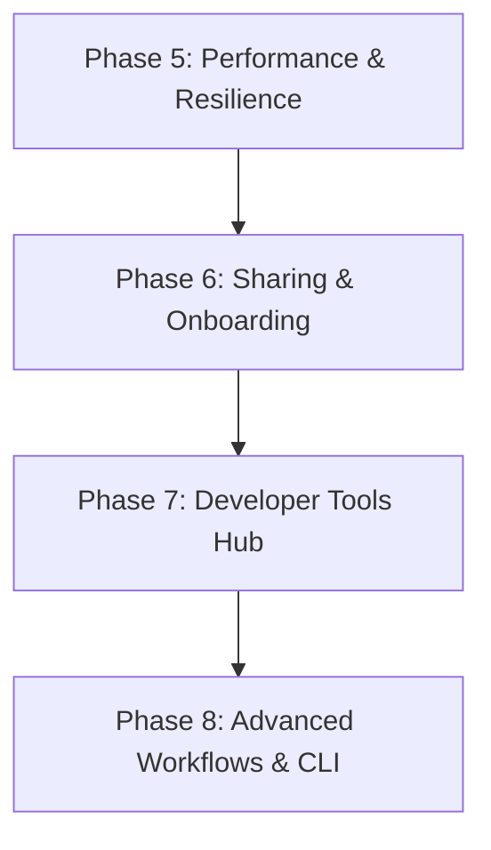

# 🗺️ KoalaSnippets Roadmap

This document outlines the planned features, future architectural enhancements, and developmental phases for KoalaSnippets. 

---

## 🚀 Future Development Phases

To ensure long-term stability, zero-bloat modularity, and a premium developer experience, the remaining roadmap items are divided into cohesive, theme-based phases.

### 🏎️ Phase 5: Performance & System Resilience
*Focuses on resource efficiency, downstream caching, and self-maintaining database systems.*

#### 1. SQLite WAL Checkpoint Automation & Maintenance
- **Description**: Prevent SQLite Write-Ahead Log (`.db-wal`) files from growing uncontrollably. Implement automated periodic WAL checkpointing (e.g., passive or truncate checkpoints) and integrate it with the database backup scheduler to ensure stability.
- **Implementation**:
  - Integrate a `checkpoint` step into `src/features/admin/utils/backup-scheduler.ts` running immediately prior to database backups.
  - Execute `PRAGMA wal_checkpoint(TRUNCATE)` via the Drizzle/better-sqlite3 instance.
- **Estimated Effort**: ~80 lines of code.

#### 2. HTTP Conditional Caching (ETag / 304 Not Modified)
- **Description**: Optimize API latency and reduce server CPU usage. When querying snippets or settings, the server responds with a unique ETag hash. Subsequent requests use `If-None-Match`, allowing the server to immediately return `304 Not Modified` and bypass database serialization.
- **Implementation**:
  - Generate ETags based on the maximum `updated_at` timestamp or content hashes of requested datasets.
  - Implement a middleware or lightweight route helper to check incoming `If-None-Match` request headers.
- **Estimated Effort**: ~150 lines of code.

#### 3. Static Edge-Caching (ISR) for Public Views
- **Description**: High-traffic public pages (like `/stats` or public snippets) should load with sub-millisecond speeds. Pre-render these pages using Next.js Incremental Static Regeneration (ISR) and Edge Caching to bypass SQLite queries entirely under heavy load.
- **Implementation**:
  - Configure route segment options for static generation.
  - Inject `revalidatePath("/snippets/[id]")` and `revalidatePath("/stats")` into relevant mutate Server Actions.
- **Estimated Effort**: ~120 lines of code.

---

### 🤝 Phase 6: Sharing & Onboarding (Collaboration Engine)
*Enhances community interaction, sharing capabilities, and the first-time user experience.*

#### 1. Snippet Forking (Community Remixes)
- **Description**: Allow users to "fork" public snippets of other developers into their own account. The cloned snippet remains independent and editable, but retains an attribution reference to the original source snippet.
- **Implementation**:
  - Add a nullable `forked_from_id` column to the `snippets` table (self-referencing `snippets.id` with `ON DELETE SET NULL`).
  - Add a Server Action `forkSnippet(id)` to clone snippet records, set the `author_id` to the current user, and set `forked_from_id = originalSnippet.id`.
  - Design a glassmorphic "Fork" button on public snippets and a lineage badge in the detailed UI.
- **Estimated Effort**: ~350 lines of code.

#### 2. QR Code Sharing & Second-Screen Transfer
- **Description**: Fast, contactless sharing of public/shared snippets to mobile devices or tablets. Open a clean modal rendering a high-contrast QR code pointing to the snippet's url for easy mobile scanning.
- **Implementation**:
  - Build a reusable client-side component using a lightweight, zero-dependency QR code canvas renderer (to maintain privacy and avoid server overhead).
  - Add custom controls in the share modal to copy raw link or download the generated QR code.
- **Estimated Effort**: ~150 lines of code.

#### 3. Immersive Visual Empty States (with Active CTAs)
- **Description**: Turn blank dashboard screens or empty search queries into premium onboarding portals. Instead of simple text descriptions, display custom SVG illustration/CSS abstract art along with prominent call-to-actions (CTAs) guiding users on how to populate their repository.
- **Implementation**:
  - Create a highly customizable `<EmptyState />` component accepting custom SVGs, text descriptions, and active CTA buttons.
  - Hook CTAs directly to quick actions (New Snippet, Import, browse public directory).
- **Estimated Effort**: ~150 lines of code.

---

### 🧰 Phase 7: The Privacy-First Developer Hub (`/tools`)
*A central, zero-bloat dashboard of essential client-side utilities for the modern developer.*

#### 1. Centralized Tools Directory (`/tools`)
- **Description**: A dedicated route group `(tools)` serving `/tools` as a beautiful cards hub. Clicking any card opens a clean, full-screen tool interface (e.g. `/tools/hash-generator`).
- **Privacy Directive**: All tools must execute 100% locally in the browser. Zero network requests, keeping tokens, passwords, and sensitive text strictly private.

#### 2. Included Utilities:
- **UUID Generator**: Bulk-generate UUIDv4 strings. Format as plain text, SQL, or JSON arrays.
- **Custom Password Generator**: Highly configurable character inclusion rules (excluding ambiguous characters like `l`, `1`, `I`, `O`, `0`).
- **Text Diff Checker**: A dual-pane split-view showing line-by-line and character-level inline modifications.
- **Cryptographic Hash Generator**: Real-time conversion of strings to MD5, SHA-1, SHA-256, SHA-512, and BCrypt hashes.
- **JSON Formatter & Validator**: Beautify, minify, and locate syntax errors in broken JSON strings.
- **JWT Decoder**: Decode and inspect JWT header/payload visually without sending sensitive signatures to external servers.
- **Base64 Encoder/Decoder**: Standard double-way conversion.
- **Estimated Effort**: ~800 lines of code (entire tools directory structure).

---

### 💻 Phase 8: Headless Workflows & CLI Integration (Power-Users)
*Bridges local terminal workflows, scripts, and external platforms directly to the KoalaSnippets server.*

#### 1. External Snippet Importer (Gists, Pastebin & Raw URLs)
- **Description**: Make migrating collections easy. Implement an import wizard where users paste public GitHub Gist links, Pastebin links, or raw text URLs. The system fetches the source, parses contents, auto-detects languages, and pre-populates files.
- **Implementation**:
  - Create secure backend parsers with SSRF protection (outbound rate-limiting and timeouts).
  - Design a unified import progress modal where users preview mapped files before creating them.
- **Estimated Effort**: ~400 lines of code.

#### 2. Personal API Keys & CLI Client (`koala`)
- **Description**: Enable pushing, searching, and pulling snippets directly from the terminal or CI/CD pipelines. Users generate secure personal API keys (Bearer tokens) in their profile settings.
- **Implementation**:
  - Add an `api_keys` table to the database, storing hashed Bearer tokens.
  - Extend the server's authentication middleware (`src/proxy.ts` or routes) to authenticate `Authorization: Bearer <token>` alongside standard session cookies.
  - Build an open-source CLI script/wrapper (`koala` push/pull commands).
- **Estimated Effort**: ~500 lines of code.

---

## ✅ Recently Implemented Features (Phase 4 & Prior)

The following roadmap items have been successfully merged and deployed:

- **Mobile Floating Action Button (FAB)**: Ergonomic mobile-only action panel fixed in the bottom-right corner for quick creation, pasting from clipboard, and file imports. (Implemented in `src/features/core/components/mobile-fab.tsx` & `sidebar.tsx`).
- **Local Auto-Save & Draft Recovery**: Prevents accidental data loss by persisting ongoing edits to `localStorage` every 3 seconds, enabling recovery alerts on reload. (Implemented in `src/features/snippets/utils/use-draft.ts` & `new/page.tsx`).
- **Multi-File Snippets & Revisions**: Support for multi-file snippets, revision history tracking, and rollbacks.
- **Hardened WAL-Mode Database**: Enabled concurrency tuning, busy timeouts, and robust connection parameters.
- **Grandfather-Father-Son Backups**: Lifecycled SQLite snapshot rotation scheduler.
