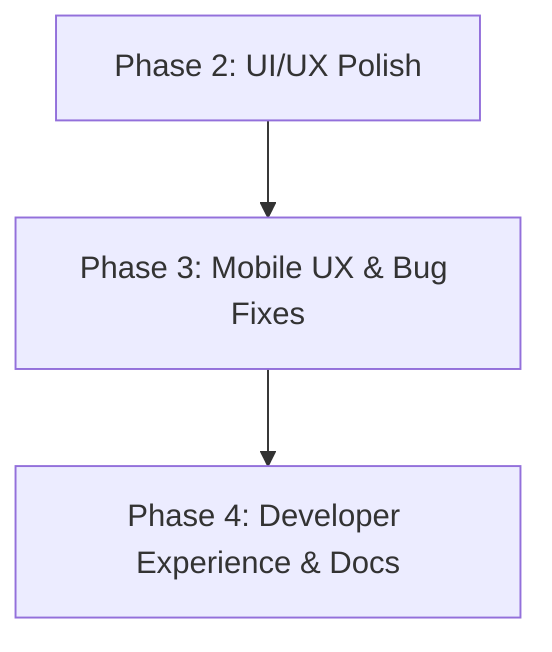

# 🗺️ KoalaSnippets Roadmap

Diese Datei dient als zentrale Planungsdokumentation für neue Features.

> **Wichtig:** Abgeschlossene Features müssen nach Deployment umgehend aus dieser Datei entfernt werden. Das ROADMAP.md soll nur offene, nicht umgesetzte Punkte enthalten.

## Format für neue Feature Requests

Jedes neue Feature soll nach folgendem Schema dokumentiert werden:

```markdown
### 🏷️ Phase X: <Thema>
*<Ein-Satz-Beschreibung der Phase>*

#### 1. <Feature-Name>
- **Description**: <Was soll das Feature tun? Welches Problem löst es?>
- **Implementation**:
  - <Konkreter Schritt 1 mit Dateipfad>
  - <Konkreter Schritt 2 mit Dateipfad>
  - <Konkreter Schritt 3 mit Dateipfad>
- **Estimated Effort**: ~XXX lines of code.
```

**Regeln:**
- Jede Phase hat ein klares Thema (z.B. "Quick Fixes", "UI/UX", "Security")
- Jedes Feature beschreibt WAS es tut, WIE es implementiert wird und WIEVIEL Aufwand es kostet
- Dateipfade müssen konkret sein (`src/features/...`, `src/app/...`)
- Geschätzte LOC beziehen sich auf die reine Code-Änderung (ohne Tests/Kommentare)
- **Nach Fertigstellung:** Feature aus dieser Datei entfernen, nicht als "erledigt" markieren

---

## 🔮 Nächste Phasen



**Priorisierungs-Logik:** UI/UX Polish (spürbare Verbesserung der wahrgenommenen Qualität) → Mobile UX & Bug Fixes (Mobile-First-Qualität, behebt echte Nutzungsprobleme) → Developer Experience (Wartbarkeit, Docs).

---

### 🎨 Phase 2: UI/UX Polish
*Sichtbare Verbesserungen des Look & Feel.*

#### 1. Fuzzy-Matching in Command Palette
- **Status**: Die Command Palette (`Ctrl+K`) hat bereits Suchverlauf (localStorage) und Slash-Commands. Die Suche nutzt aktuell nur `startsWith()` und `includes()` — kein Fuzzy-Matching.
- **Description**: Fuzzy-Suche für Slash-Commands implementieren, damit z.B. `/set` auch `/settings` findet.
- **Implementation**:
  - `src/features/core/components/command-palette.tsx`:
    - Einfache Fuzzy-Match-Logik (Levenshtein-Distanz oder Substring-Toleranz) für Slash-Commands.
    - Keine Backend-Änderungen nötig (rein client-seitig).
- **Estimated Effort**: ~40 lines of code.

#### 2. Snippet-Karten: "Zuletzt aktualisiert"-Timestamp
- **Description**: Snippet-Karten zeigen aktuell Titel, Sprache, Tags und Visibility — aber nicht wann das Snippet zuletzt bearbeitet wurde. Ein kleiner relativer Timestamp ("vor 3 Tagen", "gestern") gibt sofortige Orientierung.
- **Implementation**:
  - `src/features/snippets/components/snippet-card.tsx`:
    - `updatedAt`-Prop zum Interface hinzufügen.
    - Unterhalb des Code-Previews: `<time>`-Element mit relativem Timestamp via `Intl.RelativeTimeFormat`.
    - `updated_at` bevorzugen, Fallback auf `created_at`.
  - i18n-Keys: `updatedAgo`, `createdAgo`, `justNow`, `yesterday`.
- **Estimated Effort**: ~50 lines of code.

#### 3. Keyboard-Shortcut für Theme-Wechsel
- **Description**: Aktuell muss man für einen Theme-Wechsel nach `/settings/appearance` navigieren. Ein `Ctrl+Shift+H` Shortcut rotiert durch die verfügbaren Themes oder öffnet ein Mini-Theme-Popup.
- **Implementation**:
  - `src/features/core/components/shortcut-help.tsx`: Eintrag für `Ctrl+Shift+H` hinzufügen.
  - `src/features/snippets/utils/keyboard-shortcuts.ts`: Handler registrieren der `appearanceStore` aktualisiert.
  - Theme-Rotation über das existierende Theme-System (liest/schreibt `localStorage`-Key für Theme).
- **Estimated Effort**: ~40 lines of code.

---

### 📱 Phase 3: Mobile UX & Bug Fixes
*Behebt konkrete Mobile-Probleme die die Nutzbarkeit auf kleinen Bildschirmen einschränken.*

#### 4. Mobile Nav-Toggle: Floating Edge-Button statt FAB
- **Description**: Aktuell wird die mobile Sidebar über einen Floating-Action-Button (FAB, runder Plus-Button unten rechts) geöffnet. Das ist unintuitiv. Ersetzt werden soll das durch einen subtilen, schwebenden Pfeil-Button (`>` / `‹`) am linken Bildschirmrand.
- **Implementation**:
  - `src/features/core/components/mobile-nav-toggle.tsx` — Neue Komponente:
    - `position: fixed; left: 0; top: 50%; transform: translateY(-50%)`.
    - Chevron-Icon (`ChevronRight` wenn Sidebar geschlossen, `ChevronLeft` wenn offen).
    - `z-40` (unter der Sidebar `z-50`, über dem Content).
    - Nur sichtbar auf Mobile (`md:hidden`).
  - `src/features/core/components/sidebar.tsx`: Bestehenden MobileFAB Nav-Trigger entfernen oder anpassen.
- **Estimated Effort**: ~60 lines of code.

#### 5. Mobile Snippet-Grid: Letzte Karte abgeschnitten (Scroll-Bug)
- **Description**: Auf mobilen Geräten ist die letzte Snippet-Karte im Grid zu ~50% vom unteren Bildschirmrand verdeckt. Wahrscheinliche Ursache: Fehlendes `padding-bottom` am Grid-Container.
- **Implementation**:
  - `src/features/snippets/components/dashboard-content.tsx`: Grid-Wrapper mit `pb-20` oder `pb-24` versehen.
  - Auf realen Mobilgeräten/iOS Safari testen.
- **Estimated Effort**: ~10 lines of code.

---

### 🛠️ Phase 4: Developer Experience & Docs
*Verbessert Wartbarkeit und Onboarding für zukünftige Entwickler.*

#### 6. ARCHITECTURE.md: Veraltete Index-Dokumentation korrigieren
- **Description**: Die `docs/ARCHITECTURE.md` listet in der Sektion „Indexes" Indizes die nicht existieren (z.B. `sessions(token_hash)`, `sessions(user_id)`) und erwähnt nicht die tatsächlich vorhandenen Indizes. Das führt zu Fehlentscheidungen bei neuen Entwicklern.
- **Implementation**:
  - `docs/ARCHITECTURE.md` Zeilen 297-303: Die Index-Tabelle durch eine aktuelle, vollständige Liste ersetzen (basiert auf `src/db/schema.ts`).
  - Alle tatsächlich existierenden Indizes + Unique Constraints auflisten.
- **Estimated Effort**: ~20 lines of markdown.
