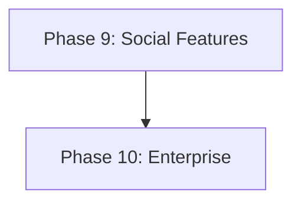

# 🗺️ KoalaSnippets Roadmap

Diese Datei dient als zentrale Planungsdokumentation für neue Features.
Abgeschlossene Features werden nach Deployment aus dieser Datei entfernt.

## Format für neue Feature Requests

Jedes neue Feature soll nach folgendem Schema dokumentiert werden:

```markdown
### 🏷️ Phase X: <Thema>
*<Ein-Satz-Beschreibung der Phase>*

#### 1. <Feature-Name>
- **Description**: <Was soll das Feature tun? Welches Problem löst es?>
- **Implementation**:
  - <Konkreter Schritt 1 mit Dateipfad>
  - <Konkreter Schritt 2 mit Dateipfad>
  - <Konkreter Schritt 3 mit Dateipfad>
- **Estimated Effort**: ~XXX lines of code.

#### 2. <Feature-Name>
...
```

**Regeln:**
- Jede Phase hat ein klares Thema (z.B. "Performance", "Sharing", "Developer Tools")
- Jedes Feature beschreibt WAS es tut, WIE es implementiert wird und WIEVIEL Aufwand es kostet
- Dateipfade müssen konkret sein (`src/features/...`, `src/app/...`)
- Der Mermaid-Graph am Anfang zeigt die Abhängigkeiten zwischen Phasen
- Geschätzte LOC beziehen sich auf die reine Code-Änderung (ohne Tests/Kommentare)

---

## 🔮 Nächste Phasen



### 🤝 Phase 9: Social & Collaboration
*Erweitert die Community-Interaktion mit Kommentaren, Reaktionen und Benachrichtigungen.*

#### 1. Snippet Comments & Discussions
- **Description**: Erlaube Nutzern, öffentliche Snippets zu kommentieren. Thread-basierte Diskussionen mit Markdown-Support.
- **Implementation**:
  - `snippet_comments` Tabelle in `src/db/schema.ts` (id, snippet_id, user_id, content, parent_id, created_at)
  - Kommentar-UI unterhalb des Code-Blocks in `src/features/core/components/detail-view.tsx`
  - API-Route `src/app/api/snippets/[id]/comments/route.ts`
- **Estimated Effort**: ~400 lines of code.

#### 2. Snippet Reactions (Emoji)
- **Description**: Quick emoji reactions (👍, ❤️, 🚀) auf Snippets ohne kompletten Kommentar.
- **Implementation**:
  - `snippet_reactions` Tabelle (snippet_id, user_id, emoji)
  - Reaktion-Leiste in DetailView und SnippetCard
  - Optimistisches UI-Update mit Debounce
- **Estimated Effort**: ~200 lines of code.

#### 3. Webhook Notifications
- **Description**: Sende Webhooks bei Events (neuer Fork, neuer Kommentar). Nutzer konfigurieren URLs in den Settings.
- **Implementation**:
  - `webhooks` Tabelle und Settings-UI in `src/app/settings/`
  - Outbound HTTP POST mit Signatur (HMAC) in `src/features/core/utils/webhook.ts`
  - Rate-Limiting und Retry-Logik
- **Estimated Effort**: ~300 lines of code.

---

### 🏢 Phase 10: Enterprise & Ops
*Features für Teams und Betrieb.*

#### 1. OAuth / OIDC Authentication
- **Description**: Login via GitHub, Google, oder generischem OIDC-Provider zusätzlich zur lokalen Registrierung.
- **Implementation**:
  - NextAuth.js oder custom OIDC-Client in `src/features/auth/`
  - `oauth_accounts` Tabelle für verknüpfte Accounts
  - Konfiguration via Environment-Variablen (`OAUTH_GITHUB_CLIENT_ID`, etc.)
- **Estimated Effort**: ~500 lines of code.

#### 2. Snippet Collections (Ordner-Struktur)
- **Description**: Hierarchische Ordner für Snippets mit Drag & Drop.
- **Implementation**:
  - `collections` Tabelle um `parent_id` und `sort_order` erweitern
  - Tree-View in der Sidebar
  - Drag & Drop API in `src/features/snippets/components/`
- **Estimated Effort**: ~350 lines of code.

#### 3. Audit Log Dashboard
- **Description**: UI für Admin-Audit-Logs mit Filterung und Export.
- **Implementation**:
  - Admin-Seite `src/app/admin/audit/page.tsx`
  - Filterbare Tabelle mit Pagination
  - CSV-Export
- **Estimated Effort**: ~200 lines of code.
